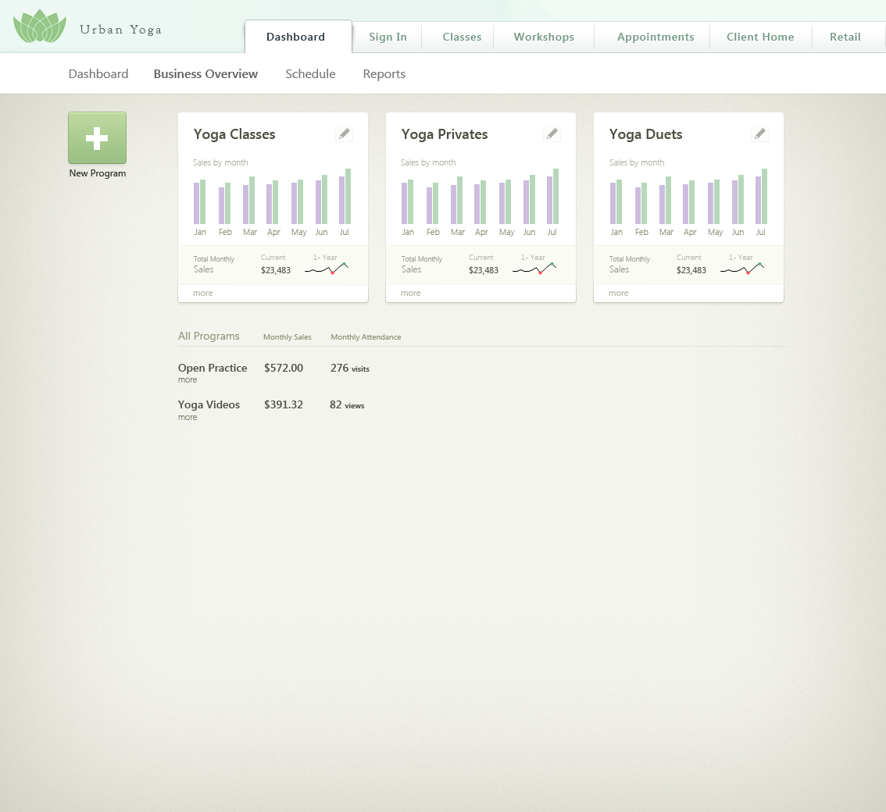
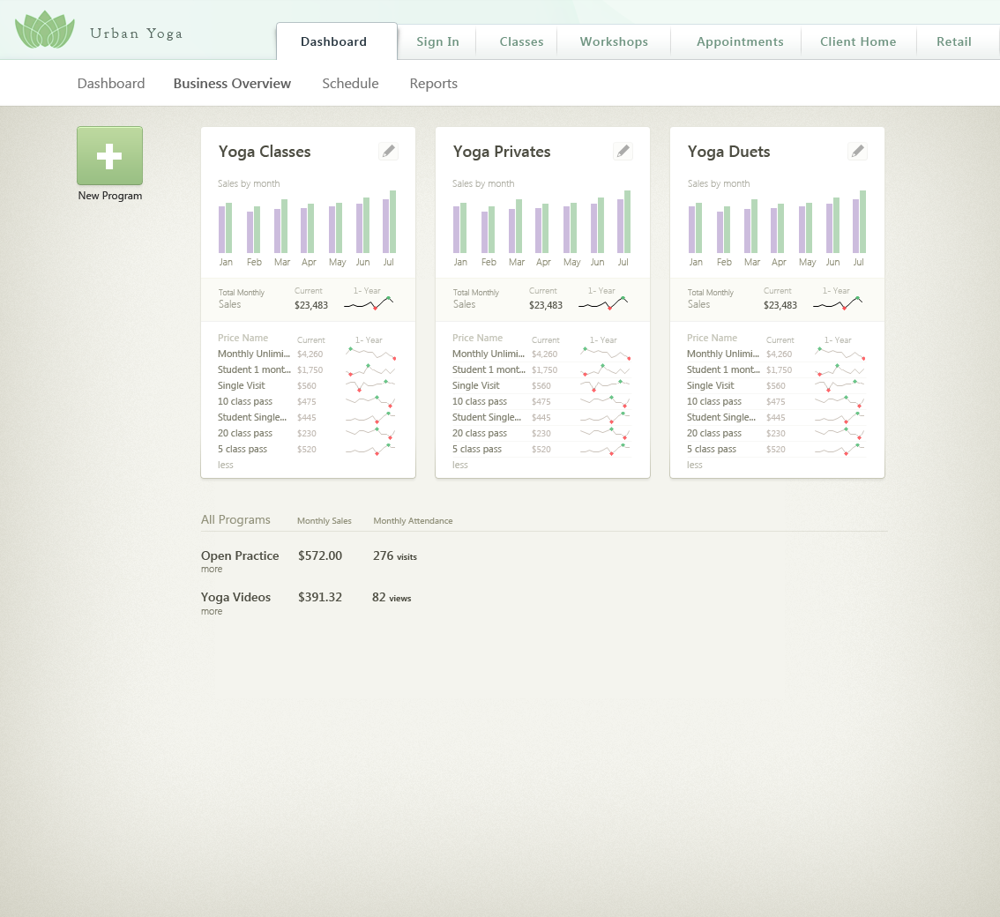

## Your challenge, should you choose to accept it
1. Clone this repo (or download the zip archive) to get started.
2. Your page should closely resemble [business_overview.png](business_overview.png) on the page load:
    
    
3. Your page should closely resemble [business_overview_expanded.png](business_overview_expanded.png) when the "more" links are clicked:
    
    
4. The pencil icon should change color on hover. You may use the provided pencil image or use a similar icon of your choice.
5. The "New Program" button should respond to hover and click (but it doesn't have to do anything when clicked)
6. You may use any front end libraries you wish to complete the task.
7. Use the following API calls to populate **any or all** parts of page. The data returned may not reflect the amounts in the business_overview.png image.      Assume that the data from these calls is correct.
    - Programs (GET: https://api.myjson.com/bins/5bdb3)
    - Pricing Options (GET: https://api.myjson.com/bins/47axv)
8. When you're finished, send a link to your GitHub repo or a .zip archive to your point-of-contact (make sure it's unminified!).

## What we're looking for
- **Attention to detail**. Can you build a near-identical representation of the screenshots we provided above? No detail is too small in our assessment.
- **Appropriate use of frameworks and tools**. You don't necessarily have to use the latest and greatest frameworks. As long as you use your preferred tools in an appropriate way and are able to describe your reasoning if asked, you're good to go.

## Help!
Should you stumble into any questions during your quest, feel free tor reach out to your recruiter or dev contact.
